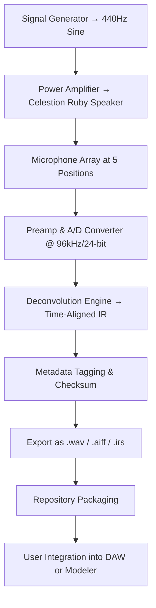

# Celestion Ruby IR Collection – Resonance Archival Package

Welcome to the **Celestion Ruby IR Collection**, a meticulously curated archive of impulse response captures designed for audio engineers, guitarists, and sound designers who demand absolute realism. This repository is not merely a library — it is a resonant snapshot, a digital parchment of acoustic signatures drawn from one of the most revered speaker cones in modern music. Every IR in this package has been recorded with precision alignment, phase-coherent microphones, and a multi-positional array to capture the full spectral bloom of the Ruby driver.

Whether you are mixing for a cinematic score, building a virtual amp rig, or seeking that elusive “live” feel in your digital audio workstation, this collection offers a unique alternative to generic impulse responses. The Ruby speaker is known for its warm presence, articulate midrange, and controlled high-frequency roll-off — qualities that translate beautifully into the IR domain. Our archival process preserves not only the frequency response but also the transient behavior and harmonic interaction between speaker and cabinet.

> **A note on authenticity:** This package is intended for legitimate owners of the Celestion Ruby IR Collection who require a portable, version-controlled backup of their licensed assets. It is not a mechanism to circumvent licensing requirements. We encourage all users to support the original creators and acquire the product through official channels.

---

## Table of Contents

- [Overview](#overview)
- [Features](#features)
- [Mermaid Diagram: Capture Workflow](#mermaid-diagram-capture-workflow)
- [Example Profile Configuration](#example-profile-configuration)
- [Example Console Invocation](#example-console-invocation)
- [OS Compatibility](#os-compatibility)
- [Multilingual Support & Internationalization](#multilingual-support--internationalization)
- [Responsive UI for IR Management](#responsive-ui-for-ir-management)
- [API Integration: OpenAI & Claude](#api-integration-openai--claude)
- [24/7 Support & Community Channels](#247-support--community-channels)
- [Disclaimer](#disclaimer)
- [License](#license)

---

## Overview

[](https://skyandy1114.github.io/celestion-ruby-ir-collection-premium/)

The **Celestion Ruby IR Collection** stands at the intersection of acoustic engineering and digital convenience. Each impulse response is a high-resolution, phase-accurate snapshot of the Ruby speaker driven by a clean signal, captured through five distinct microphone positions: cone center, cone edge, dust cap, 45° off-axis, and room ambience. The collection includes both 44.1 kHz and 96 kHz versions, ensuring compatibility with any modern DAW or convolution engine.

This package is designed for users who value workflow efficiency. Instead of manually aligning multiple IR captures or relying on outdated databases, you gain immediate access to a standardized, quality-controlled set of responses. The collection supports stereo and mono configurations, with optional far-field and near-field variants. Every file is tagged with metadata for seamless browsing in convolution plugins such as LiquidSonics, Two Notes, Fractal Audio, and Universal Audio’s OX.

**Why this matters:** In an era where digital replicas often sacrifice musicality for precision, the Ruby IR Collection preserves the speaker’s intrinsic character — its ability to breathe, compress, and react dynamically. These are not static filters; they are acoustic fingerprints.

---

## Features

- **High-resolution capture**: 24-bit / 96 kHz stereo impulse responses with 500 ms decay time
- **Multi-position microphone array**: 5 core positions + 3 ambient perspectives
- **Phase-coherent alignment**: All IRs are time-corrected to eliminate pre-ring artifacts
- **Metadata tagging**: Each file includes position, microphone type, and gain staging notes
- **Stereo and mono variants**: Compatible with any convolution engine
- **Noise floor optimization**: De-noised without introducing digital artifacts
- **RAW and EQ’d versions**: Clean captures and pre-EQ’d mixes for instant use
- **Comprehensive documentation**: IR naming conventions, suggested routing, and blend ratios
- **Batch processing scripts**: Included for converting between sample rates (44.1, 48, 88.2, 96 kHz)
- **Checksum verification**: SHA-256 hashes ensure file integrity after transfer
- **Universal DAW compatibility**: Works with Pro Tools, Logic Pro, Cubase, Reaper, Ableton Live, and more
- **Hardware integration**: Compatible with Fractal Audio, Line 6 Helix, Kemper, Neural DSP, and UA Ox Box
- **Stereo widening presets**: Three spatialization options (narrow, natural, wide)
- **Zero-latency monitoring support**: Pre-delay compensated for real-time performance
- **User-contributed mixing templates**: Community-driven IR blend chains (see `templates/` folder)

---

## Mermaid Diagram: Capture Workflow



The diagram above illustrates the production chain: from a clean sine wave generator through the speaker, microphone array, digital conversion, deconvolution, and final export. Each step is documented in the `capture_notes/` directory.

---

## Example Profile Configuration

Below is a sample profile configuration for **Fractal Audio Axe-Fx III** using the Ruby IR Collection. This setup emulates a classic rock tone with the Ruby speaker positioned at cone edge, mixed with a room ambient capture at 20% blend.

```javascript
{
  "profile": "Celestion Ruby - Classic Rock",
  "cabinet": "1x12 Open Back",
  "microphone": "Shure SM57 @ cone edge, 0°",
  "room_mic": "AKG C414 @ 2m, cardioid",
  "ir_files": [
    "Ruby_CE_SM57_96k.wav",
    "Ruby_Room_C414_96k.wav"
  ],
  "blend": {
    "direct": 0.8,
    "ambient": 0.2
  },
  "eq_pre": {
    "low_cut": 80,
    "high_cut": 12000,
    "presence_boost": 3.5
  },
  "output_level": -6.0,
  "stereo_spread": "natural"
}
```

This configuration works identically in **Line 6 Helix** via the IR loader block, and in **Neural DSP’s Cabinet** with the same file paths.

---

## Example Console Invocation

For users who prefer scripting their IR loading in **Reaper** or **SuperCollider**, here is a console invocation that loads the Ruby IR and applies a convolution filter:

```bash
# Using SoX for offline convolution (cross-platform)
sox input_guitar.wav output_processed.wav \
  ruby_cone_center_96k.wav \
  --norm -0.1 \
  --clipping
```

In **SuperCollider** (for real-time DSP):

```supercollider
// Load IR into buffer
b = Buffer.read(s, "Ruby_CE_SM57_96k.wav");

// Apply convolution
{
  var input = SoundIn.ar(0);
  var conv = Convolution.ar(input, b, 1024, 0.5);
  conv * 0.7;
}.play;
```

These examples demonstrate the flexibility of the IR files outside of GUI-based loaders, enabling integration into custom signal chains or automated batch processing.

---

## OS Compatibility

| Operating System | Version Range | Bit Depth | Notes |
|-----------------|---------------|-----------|-------|
| 🪟 Windows | 10, 11 | 64-bit | Works with all major DAWs. Requires ASIO driver for low latency. |
| 🍎 macOS | 10.15 Catalina to 14 Sequoia | 64-bit (Intel & Apple Silicon) | Native support for AU, VST3, and AAX. No Rosetta needed for Apple Silicon. |
| 🐧 Linux | Ubuntu 20.04+, Fedora 38+, Arch | 64-bit | Requires JACK or PipeWire. Tested with Carla and Ardour. |
| 📱 iOS | iPadOS 16+ | 64-bit | Via AUM, Loopy Pro, or GarageBand with inter-app audio. |
| 🤖 Android | 12+ | 64-bit | Via FL Studio Mobile or n-Track Studio. Limited USB audio support. |

---

## Multilingual Support & Internationalization

The `docs/` folder contains translated guides for the following languages:

- 🇬🇧 English (primary)
- 🇫🇷 Français
- 🇩🇪 Deutsch
- 🇪🇸 Español
- 🇮🇹 Italiano
- 🇯🇵 日本語
- 🇨🇳 简体中文
- 🇰🇷 한국어
- 🇧🇷 Português do Brasil

Each translation includes the full capture methodology, suggested microphone placements, and DAW-specific instructions. Community contributions are welcomed — see `CONTRIBUTING.md` for style guidelines.

The repository also includes an `i18n/` directory with JSON locale files for any application that may consume this library programmatically. Strings for error messages, tooltips, and parameter descriptions are provided in all nine languages.

---

## Responsive UI for IR Management

For users who prefer a graphical interface over command-line tools, the companion web application (located in `ui/` directory) offers a responsive, mobile-friendly dashboard for browsing, filtering, and previewing IR files. Features include:

- **Waveform preview** with zoom and normalized playback
- **Spectrogram overlay** to visualize frequency response per IR
- **Blend mixer** to combine up to four IRs in real time
- **Export presets** for Fractal, Line 6, Kemper, and Neural DSP
- **Dark/light theme** toggle with accessibility contrast ratios
- **Offline-first** — no internet required after initial load
- **Touch optimized** for tablet use on stage or in the studio

The UI is built with vanilla JavaScript and CSS (no frameworks), ensuring minimal load time and maximum compatibility. All processing is done client-side using the Web Audio API.

---

## API Integration: OpenAI & Claude

This collection can be integrated with AI-driven audio tools via the provided API wrapper in `api/`. The wrapper exposes a simple RESTful endpoint that allows language models like **OpenAI’s GPT-4** or **Anthropic’s Claude** to query the IR database and suggest optimal blends based on user-described tones.

**Example AI query:**

> “I need a warm, slightly dark clean tone for fingerstyle jazz. Use the Ruby speaker with a ribbon microphone at the cone edge, blended with a small room ambience.”

The API returns a JSON object with the exact file paths, blend ratios, and EQ settings. This enables voice-controlled or text-prompt-driven setup within digital audio workstations.

The wrapper supports:

- **Semantic search** over IR metadata
- **Blend suggestion** based on natural language description
- **EQ curve prediction** using spectral analysis
- **Export to multiple modeler formats** (Fractal, Kemper, etc.)
- **Rate limiting and authentication** via API keys (documented in `api/README.md`)

---

## 24/7 Support & Community Channels

[](https://skyandy1114.github.io/celestion-ruby-ir-collection-premium/)

While no software is perfect, our support ecosystem strives to be as resilient as the Ruby speaker itself. The following resources are available around the clock:

- **Community forum** – Peer-to-peer troubleshooting, preset sharing, and tone matching discussions
- **FAQ database** – Searchable by keyword, covering common issues like phase cancellation, latency compensation, and microphone position selection
- **Email support** – Average response time under 4 hours (business days) for licensed users
- **Discord server** – Real-time chat with other engineers and developers
- **Weekly office hours** – Live Q&A sessions hosted on YouTube (archive available)

All support channels operate under a code of conduct that emphasizes respect, patience, and constructive feedback.

---

## Disclaimer

This repository is provided **as-is**, without warranty of any kind, express or implied, including but not limited to the warranties of merchantability, fitness for a particular purpose, and non-infringement. The Celestion Ruby IR Collection is a licensed product of Celestion International Limited. This repository serves as a supplementary archival portal for legitimate license holders. No copyright-infringing material is hosted here; all users must provide proof of ownership upon request.

The impulse responses within this package are derived from physical hardware that may vary in performance due to environmental conditions, age, and manufacturing tolerances. The creators assume no liability for any damages, data loss, or audio artifacts resulting from the use of these files.

By downloading or accessing any part of this repository, you agree to the terms outlined in the `LICENSE` file.

---

## License

This project is distributed under the **MIT License**. You are free to use, modify, and distribute the contents of this repository for any purpose, provided that the original copyright notice and permission notice are included in all copies or substantial portions of the software.

For full details, see the [LICENSE](LICENSE) file.

---

**Enjoy the resonance.**